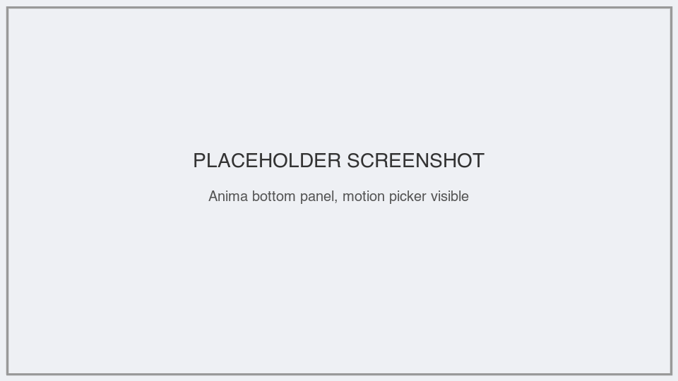
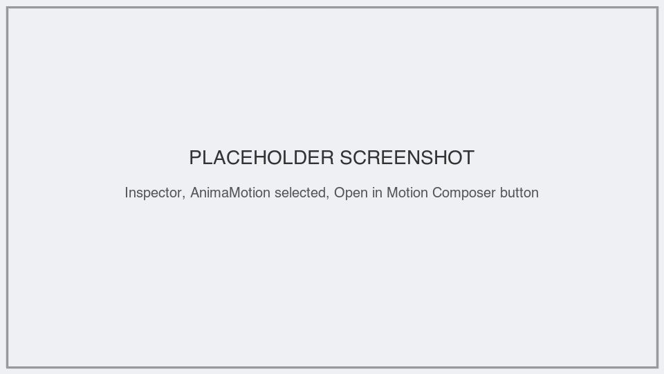
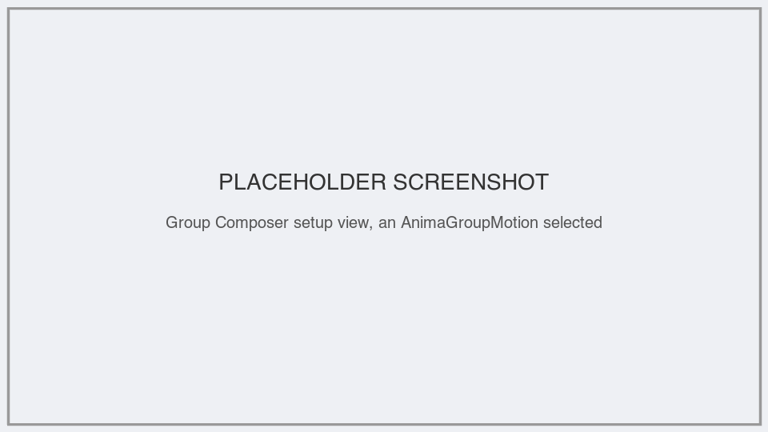
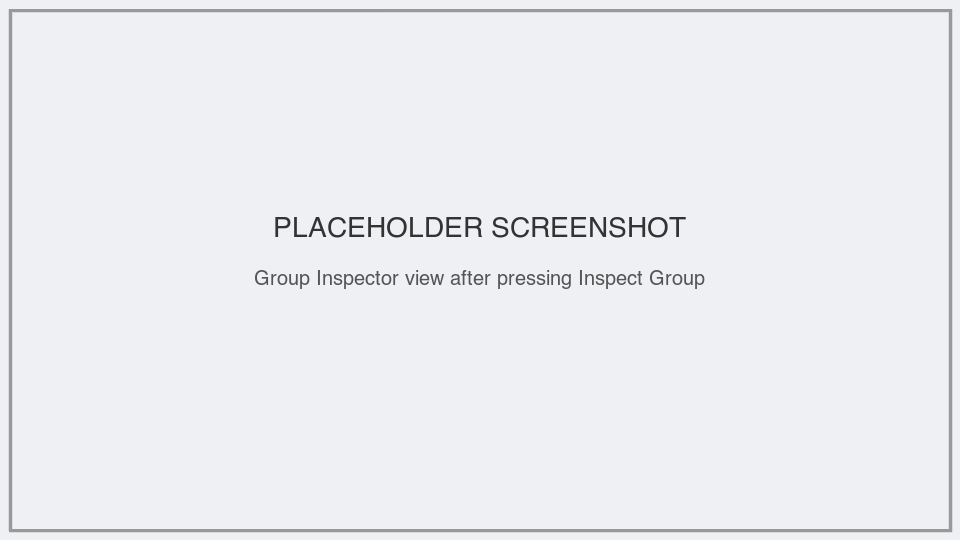

## What it does

The Motion Composer lets you open any [`AnimaMotion`](../../anima/anima-motion)
resource and edit it — the same resource your code plays with
[`Anima.play()`](../../anima/anima). Editing a value here changes the
authored resource directly; there is no separate visual-only copy, so what
you see in the panel is exactly what plays.

It has three views, and you move between them as you work:

- **Setup** — edit an [`AnimaGroupMotion`](../../anima/anima-group-motion) with the
  Group Composer, or an [`AnimaPropertyMotion`](../../anima/anima-property-motion)
  with the Property Motion Composer.
- **Inspection** — read-only view of a group's resolved targets, generated
  timing, validation messages, and whether it can compile into a native
  `Animation`.

## Opening the panel

The **Anima** tab lives at the bottom of the Godot editor, next to Output and
Debugger, for as long as the Anima plugin is enabled.

<!-- PLACEHOLDER: screenshot needed — Godot editor with the "Anima" bottom panel open, motion picker dropdown visible, docked next to Output/Debugger -->

The panel starts empty ("Open an Anima motion from the Inspector."). To load a
motion graph into it:

1. Select a node in the scene tree whose Inspector shows an `AnimaMotion`
   resource (for example, a script's exported `AnimaGroupMotion` field).
2. Click that resource in the Inspector to expand it. A button reading
   **Open in Motion Composer** appears above its properties.
3. Press it. The panel now shows that resource as the root of the open graph.

<!-- PLACEHOLDER: screenshot needed — Godot Inspector with an AnimaMotion resource expanded, the "Open in Motion Composer" button visible above its properties -->

Once a graph is open, the panel's dropdown lists every motion inside it (the
root motion plus any children a `Sequence`, `Parallel`, or `Race` holds).
Picking one from the dropdown selects it for editing.

Separately, whichever scene node is selected in the Godot scene tree becomes
the panel's **scene node context** — used to resolve group targets, read a
property's current value, and drive Preview. This follows your scene
selection continuously; it does not need to be the same node the open motion
came from.

## Editing a group motion

Selecting an `AnimaGroupMotion` in the dropdown shows the Group Composer:

- **Target collection** and **Item motion** — resource pickers for the
  group's target set and the motion each target plays.
- **Playback** — Sequential, Parallel, or Staggered, with the matching gap or
  stagger fields appearing underneath.
- **Order**, **Origin** (for Grid/Distance order), **Target source**,
  **Filter**, **Completion**, **Reverse order**, **Invalid target**, and
  **Empty group** — the same policy choices the resource exposes in code.
- **Preview / Stop / Reverse** — plays the group against the current scene
  node context so you can see the change without running the scene.

<!-- PLACEHOLDER: screenshot needed — Motion Composer Setup view with an AnimaGroupMotion selected, showing the Target collection/Playback/Order fields and the Preview/Stop/Reverse row -->

If the selected motion is a `Sequence`, `Parallel`, or `Race` rather than a
group itself, the Group Composer instead offers an **Add Group Motion**
button to insert one as a new child.

## Editing a property motion

Selecting an `AnimaPropertyMotion` shows the Property Motion Composer
instead. If the motion was created through a convenience call like
[`Anima.on()`](../../anima/anima-on-motion-factory) or
[`Anima.item()`](../../anima/anima-item-motion-factory), its friendly name (Move
By, Scale, Opacity, Colour, and so on) is shown alongside the property path
it actually edits — otherwise it's labelled plainly as "Property Motion".

- **From** — optional; leave it blank to read the target's current value
  when playback starts.
- **To**, **Duration**, **Ease** — the motion's end value, length, and easing
  curve.
- **Property search** — with a scene node selected as context, type to find
  and pick any of that node's properties as the target property.
- A status line shows the target property's current live value, or a
  validation message when the property can't be found on the selected node.

<!-- PLACEHOLDER: screenshot needed — Motion Composer Setup view with an AnimaPropertyMotion selected, showing the semantic name label, From/To/Duration/Ease fields, and the property search box -->

## Inspecting a group

With a group motion selected in Setup, an **Inspect Group** button appears.
Pressing it switches to the Inspection view:

- **Validate** re-runs target resolution and scheduling and refreshes the
  view below.
- **Compile** builds a native `Animation` from the group when it's eligible;
  the status line reads "Eligible for compilation." once it is, or shows the
  first blocking message when it isn't.
- The list below shows every resolved target in play order, each with the
  offset (in seconds) it starts at — the same resolution and schedule
  [`Anima.play()`](../../anima/anima) uses, not a separate preview-only copy.
- **Back to Setup** returns to editing the same group.

<!-- PLACEHOLDER: screenshot needed — Motion Composer Inspection view for a group with at least one resolved target, showing the status line and the numbered target/offset list -->

## Undo and redo

Every field in the Group Composer and Property Motion Composer edit
resources through Godot's own undo/redo history, so <kbd>Ctrl+Z</kbd> /
<kbd>Ctrl+Shift+Z</kbd> (<kbd>Cmd+Z</kbd> / <kbd>Cmd+Shift+Z</kbd> on macOS)
step the authored motion back and forth like any other editor edit.
