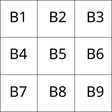

# AnimaNode

## Usage

This node is used to handle the setup of all the animations supported by the addon.
There are two ways you can use it:

1. By manually adding the node to your scene
2. Via gdscript

### 1. Manually added to the scene

Suppose we have added the node to our scene and its name is "AnimaNode", now we can access to its functionality with, for example:

```gdscript
$AnimaNode.then({ node = $node, animation = "tada", duration = 0.7 })
$AnimaNode.play()
```

### 2. Gdscript way

To add the node programmatically via gdscript you have to invoke the [begin](#begin) function first:

```gdscript
var anima := Anima.begin(self)

anima.then({ node = $node, animation = "tada", duration = 0.7 })
anima.play()
```

## Signals

### animation_started

Emitted when the animation or loop starts

```gdscript
signal animation_started
```

### animation_completed

Emitted when the animation or loop starts

```gdscript
signal animation_completed
```

### loop_started
Emitted a loop starts

```gdscript
signal loop_started(loop_count: int)
```

### loop_completed

Emitted a loop completes

```gdscript
signal loop_completed(loop_count: int)
```


## Methods

- [then(animation_data: Dictionary)](#then-sequential-animations)
- [with(animation_data: Dictionary)](#with-parallel-animations)
- [clear()](#clear)
- [get_length()](#get-length)
- [hide_strategy(strategy)](#hide-strategy)
- [play()](#play)
- [play_with_delay(delay)](#play-with-delay)
- [stop()](#stop)
- [set_loop_strategy()](#set-loop-strategy)

## animation_data

The biggest difference between Anima and the Godot Tween is that you need to pass a Dictionary, instead a list of arguments.

### Why?

Because due to its flexibility, Anima does support 14 different options, and most of them are optional. So, having a list of arguments would have been too complicated to remember each position.

So, for this reason, Anima accepts a dictionary whose values are easy to remember and straightforward:

|Key|Type|Required|Description|
|---|---|---|---|
|node|Node*|Yes/No*|The single node you want to animate|
|[group](#group)|Node|Yes/No*|The group you want to animate|
|[grid](#grid)|Node|Yes/No*|The grid you want to animate|
|[animation](#animation)|String|Yes/No*\*|The animation to apply|
|[animation_type](#animation-type)|String|No|The grid group animation type|
|[point](#point)|Vector2|No|The starting point used by animation_type == Anima.GRID.FROM_POINT|
|[grid_size](#grid-size)|Vector2|Yes (for grid only)|The grid size|
|[items_delay](#items-delay)|float|No|The incremental delay to apply for each element of the grid/group|
|[property](#property)|String|Yes/No*\*|The property to animate|
|from|Variant|No|The initial value, if omitted the current node property value will be used|
|to|Variant|Yes/No|The final value. Required **only** if you're passing the "property" key|
|[relative](#relative)|boolean|No|If true, the from and to value are applied according to the current node property value. (See example for more info)|
|duration|float|No|The duration of the animation in seconds. _Default 0.7s_|
|delay|float|No|The animation delay. You can also use negative values to anticipate a sequential/parallel animation|
|[easing](#easing)|Anima.EASING|No|The easing to use. _Default: LINEAR_|
|[easing_points](#easing-points)|Array|No|The four easing points to use for the bezier curve|
|[pivot](#pivot)|Anima.PIVOT|No|The pivot point|
|[hide_strategy](#hide-strategy)|Anima.Visibility|No|Allows to specify the `hide_strategy` for a single node|
|[on_started](#on-started)|Funcref|No|The function to call when the animation starts|
|[on_completed](#on-completed)|Funcref|No|The function to call once an animation is completed|

\* One of the three key is required: node, grid or group

\** You can only use one of the key at the time


### group

This method is used to animate all the direct child of the node specified.

So, suppose you have three buttons as a child of a VBoxContainer. You want to animate all of them in sequence using the same animation. In this case, the `group` method is the perfect choice for you, as it
allows you to specify the group and the animation to use for each direct child of it.

#### Syntax

```gdscript
then({ group = $Group, items_delay = float })
```

|Parameter|Type|Description|
|---|---|---|
|group|Node|The node of whom children we want to animate|
|items_delay|float|(Optional) the incremental delay to apply for each child of the group|

#### Example:

```gdscript

# VBoxContainer
#   |-> Button1
#   |-> Button2
#   |-> Button3
var anima := Anima.begin($VBoxContainer)

anima.then( { group = $VBoxContainer, items_delay = 0.3, property = "opacity", from = 0, to = 1 })
anima.play()
```

The following example will animate the three child node of the `VBoxContainer`, Button1, Button2 and Button3.
The animation of each child node will be delayed of 0.3 seconds between each other, so:

1. Button1 -> delay = 0
2. Button2 -> delay = 0.3
3. Button3 -> delay = 0.6

### grid

This method is used to treat all the node's direct child as part of a grid, and animate them accordingly

#### Syntax

```gdscript
then({ grid = Node, grid_size = Vector2 })
```

|Parameter|Type|Description|
|---|---|---|
|grid|Node|The node of whom children we want to animate|
|grid_size|Vector2|The size of the grid (m * n)|
|items_delay|float|(Optional) the incremental delay to apply for each child of the grid|

#### Example:

Suppose we have a parent node with nine child button. We can consider them as a node on a grid of 3x3:



This allows us to animate them using different method of grouping, for example:

- Anima.GRID.ROWS_ODD => Will animate elements in odd rows: B1, B2, B3 and B8, B8, B9
- Anima.GRID.EVEN => Will animate elements where the sum of their index is even: B1, B3, B5, B7, B9

For more info see [enums](#group-grid)

```gdscript
var anima := Anima.begin($VBoxContainer)

anima.then({
  grid = $VBoxContainer,
  grid_size = Vector2(3, 3),
  animation_type = Anima.GRID.EVEN,
  property = "opacity",
  from = 0,
  to = 1,
  duration = 0.3
})

anima.then({
  grid = $VBoxContainer,
  grid_size = Vector2(3, 3),
  animation_type = Anima.GRID.ODD,
  property = "opacity",
  from = 0,
  to = 1,
  duration = 0.3
})

anima.play()
```

The following example will fade in the elements in the following order:

1. B1, B3, B5, B7, B9
2. B2, B4, B6, B8

### animation

This parameter is the animation name to use. For the built-in animations you can specify the name space separated, camel case, or _ separated, for example:

"Bouncing In" animation can be used:

```gdscript
{ animation = "Bouncing in" }
{ animation = "bouncingIn" }
{ animation = "bouncing_in" }
```

### property

You can pass any node property you want to animate like you would with a Tween.
Because different Nodes uses slightly different names for the same properties, Anima provides some additional properties that are node type independent.

|Anima property|Type|Control|Node2D|Spatial|Description|
|---|---|---|---|---|---|
|x|float|Yes|Yes|Yes|This is equivalent to "rect_position:x" for Control nodes, and "global_position:x" for Node2D ones|
|position:x|float|Yes|Yes|Yes|This is equivalent to "x"|
|y|float|Yes|Yes|Yes|This is equivalent to "rect_position:y" for Control nodes, and "global_position:y" for Node2D ones|
|position:x|float|Yes|Yes|Yes|This is equivalent to "y"|
|position|Vector2 / Vector3|Yes|Yes|Vector3|This is equivalent to "rect_position" for Control nodes, and "global_position" for Node2D ones|
|opacity|float|Yes|Yes|No|This will animate the alpha channel of the node modulate property|
|rotation|float|Yes|Yes|Yes|Rotation in degrees, equivalent to "rect_rotation" for Control nodes, "rotation_degrees" for Node2D and "rotation" for Spatial ones|
|skew:x|float|No|Yes|No|Simulate the skewX effect by modifying the get_global_transform().y.x value|
|skew:y|float|No|Yes|No|Simulate the skewY effect by modifying the get_global_transform().x.y value|
|shader_param:[param_name]|Varian|No|No|Yes|The shader parameter to update.Example `shader_param:albedo` calls "set_shader_param('albedo', [value of the current frame])"|

**NOTE** To make your animation Node type independent Anima will try to prepend the "rect_" attribute for you.
So, if you want to animate the "scale" and want to make the animation work for both *Control* and *Node2D*, you can just:

```gdscript
{ property = "scale" }
```

It will animate the "rect_scale" property for Control nodes and "scale" for the Node2D ones.

### animation_type

This parameter allows you to specify the order to animate the elements in the given group/grid.

```gdscript
enum GRID {
	TOGETHER,
	SEQUENCE_TOP_LEFT
	COLUMNS_ODD,
	COLUMNS_EVEN,
	ROWS_ODD,
	ROWS_EVEN,
	ODD,
	EVEN,
	FROM_CENTER,
	FROM_POINT
}
```
_Default:_ SEQUENCE_TOP_LEFT

|Anima.GRID|Description|
|---|---|---|---|
|TOGETHER|All the nodes will be animated at the same time|
|SEQUENCE_TOP_LEFT|The nodes will be animated in order from top left corner to the bottom right|
|COLUMNS_ODD|Animated only the elements whose grid column is odd|
|COLUMNS_EVEN|Animated only the elements whose grid column is even|
|ROW_ODD|Animated only the elements whose grid row is odd|
|ROW_EVEN|Animated only the elements whose grid row is even|
|ODD|Animated only the elements whose column + row index is odd|
|EVEN|Animated only the elements whose column + row index is even|
|FROM_CENTER|Animated the group/grid staring from its center|
|FROM_POINT|Animated the group/grid staring from the specified point|

**NOTE**: A group is considered as a `n x 1` grid, where `n` is the number of nodes.

#### example

```gdscript
	group1.then({ 
		grid = $Grid,
		grid_size = grid_size,
		animation_type = Anima.GRID.COLUMNS_EVEN,
		property = "x",
		to = 5, 
		relative = true,
		duration = 0.3,
		easing = Anima.EASING.EASE_OUT_SINE,
		items_delay = 0
	})
```

animates only the elements whose column index is even, for example:

|Column 1|Column 2|Column 3|
|---|---|---|
|[Node 1]|[Node 2]|[Node 3]|
|[Node 4]|[Node 5]|[Node 6]|
|[Node 7]|[Node 8]|[Node 8]|

The animation will only be applied to the nodes in column 2: _Node 2_, _Node 5_, _Node 8_

### point
Specify a starting point within the group/grid from where the animation starts.


#### example

```gdscript
	group1.then({ 
		grid = $Grid,
		grid_size = Vector2(5, 5),
		animation_type = Anima.GRID.POIN,
		point = Vector2(1, 1)
		property = "x",
		to = 5, 
		relative = true,
		items_delay = 0.01,
		duration = 0.3,
		easing = Anima.EASING.EASE_OUT_SINE,
		items_delay = 0
	})
```

This will animate all the elements in the grid starting from the point (1, 1) and then will propagate to all the other nodes according to their distance from `point`.

See [2D Grid](https://anima.ceceppa.me/demo) or checkout [the code example](https://github.com/ceceppa/anima-demos/blob/main/demos/2DGrid.gd) for more information.

### grid_size

Specifies the grid size. 


#### example

```gdscript
	group1.then({ 
		grid = $Grid,
		grid_size = Vector2(3, 3),
	})
```

This says that the elements are displaced on a virtual grid of size 3x3.

### items_delay

The incremental delay to apply for each node of the grid/group

#### example


```gdscript
	group1.then({ 
		group = $Group,
		items_delay = 0.5
	})
```

Suppose our group is composed of 5 elements, the delay applied will be:

|Node|Delay|
|---|---|
|Node 1|0.0|
|Node 2|0.5|
|Node 3|1.0|
|Node 4|1.5|
|Node 5|2.0|

### relative

If set to `true` the *from* and *to* value will be calculated from the corresponding value of the node when the animation is executed*.

Let's have a look at the following grid:


#### relative = false
Suppose we want to animate the Green square. If we do:

```gdscript
anima.then({ node = $green, property = "position", to = Vector2(1, 0) })
anima.play()
```

The final position will be:


This because we specified specified the global final position. Also, if we play the animation again
the node won't move and stays in the same position.

#### relative = true

Let's animate now the node according to its relative position:

```gdscript
anima.then({ 
  node = $green,
  property = "position",
  to = Vector2(1, 1),
  relative = true })
anima.play()
```

The final position will be:


So we moved the node of 1 square left and 1 square down according to its relative position. This also means that if we play the animation again it will end up on the square (4, 5). This because every time we play the animation Anima will re-check what is its current position.

The same applies to the *from* value, if we do:

```gdscript
anima.then({ 
  node = $green,
  property = "position",
  from = Vector2(-1, -1),
  relative = true
})
anima.play()
```

and play the animation, we will see its position being animated from (1, 2) to its original position (2, 3).

### easing

Here the list of the built-in easings:

- EASE
- EASE_IN_OUT
- EASE_IN
- EASE_OUT
- EASE_IN_SINE
- EASE_OUT_SINE
- EASE_IN_OUT_SINE
- EASE_IN_QUAD
- EASE_OUT_QUAD
- EASE_IN_OUT_QUAD
- EASE_IN_CUBIC
- EASE_OUT_CUBIC
- EASE_IN_OUT_CUBIC
- EASE_IN_QUART
- EASE_OUT_QUART
- EASE_IN_OUT_QUART
- EASE_IN_QUINT
- EASE_OUT_QUINT
- EASE_IN_OUT_QUINT
- EASE_IN_EXPO
- EASE_OUT_EXPO
- EASE_IN_OUT_EXPO
- EASE_IN_CIRC
- EASE_OUT_CIRC
- EASE_IN_OUT_CIRC
- EASE_IN_BACK
- EASE_OUT_BACK
- EASE_IN_OUT_BACK
- EASE_IN_ELASTIC
- EASE_OUT_ELASTIC
- EASE_IN_OUT_ELASTIC
- EASE_IN_BOUNCE
- EASE_OUT_BOUNCE
- EASE_IN_OUT_BOUNCE

Have a look to [this site](https://easings.net/) to see the difference between each of them

### easing_points

This allows you to pass custom points to the cubic bezier.
You can use this website to generate your own: [https://cubic-bezier.com](https://cubic-bezier.com)

#### Example

```gdcsript
then( { node = $node1, easing_points = [1, 0.15, 0, 0.14]} )
```

### pivot

Sets the pivot point. Godot does not support pivot point for Node2D nodes yet, so Anima uses a hacky way to simulate them.

Supported pivot points:

- CENTER
- CENTER_BOTTOM
- TOP_CENTER
- TOP_LEFT
- LEFT_BOTTOM
- RIGHT_BOTTOM

### on_started

The callback to invoke when the single node animation completes.

#### Syntax

`on_started = [Funcref, [params]]`

|Parameter|Description|
|---|---|
|FuncRef|A Godot [funcref](https://docs.godotengine.org/en/stable/classes/class_funcref.html)|
|params|(Optional) An array of params to pass to the callback|

#### Example

```gdscript
_animation = Anima.begin(self, 'sequence_callback')
_animation.then({ node = $Button1, animation = "flash", duration = 1, on_started = [funcref(self, '_on_button_started'), [1]] })
_animation.then({ node = $Button2, animation = "tada", duration = 1, on_started = [funcref(self, '_on_button_started'), [2]] })
_animation.then({ node = $Button3, animation = "shakeX", duration = 1, on_started = [funcref(self, '_on_button_started'), [3]] })

func _on_button_started(index: int) -> void:
  print(index)
```

When the animation of each $Button1, $Button2, $Button3 node completed the `_on_button_started` will be called with the corresponding parameter:

1. _$Button1_ starts --> `_on_button_started(1)` is executed
1. _$Button2_ starts --> `_on_button_started(2)` is executed
1. _$Button3_ starts --> `_on_button_started(3)` is executed

### on_completed

The callback to invoke when the single node animation completes.

#### Syntax

`on_completed = [Funcref, [params]]`

|Parameter|Description|
|---|---|
|FuncRef|A Godot [funcref](https://docs.godotengine.org/en/stable/classes/class_funcref.html)|
|params|(Optional) An array of params to pass to the callback|

#### Example

```gdscript
_animation = Anima.begin(self, 'sequence_callback')
_animation.then({ node = $Button1, animation = "flash", duration = 1, on_completed = [funcref(self, '_on_button_completed'), [1]] })
_animation.then({ node = $Button2, animation = "tada", duration = 1, on_completed = [funcref(self, '_on_button_completed'), [2]] })
_animation.then({ node = $Button3, animation = "shakeX", duration = 1, on_completed = [funcref(self, '_on_button_completed'), [3]] })

func _on_button_completed(index: int) -> void:
  print(index)
```

When the animation of each $Button1, $Button2, $Button3 node completed the `_on_button_completed` will be called with the corresponding parameter:

1. _$Button1_ completes --> `_on_button_completed(1)` is executed
1. _$Button2_ completes --> `_on_button_completed(2)` is executed
1. _$Button3_ completes --> `_on_button_completed(3)` is executed

## Reference

### then (sequential animations)

The `then` method allows you to specify the animations to be played in sequence.

#### Syntax

```gdscript
then( animation_data: Dictionary )
```

#### Example

```gdscript
var anima := Anima.begin(self, 'sequential')

anima.then( { node = $node1, property = "x", to = 10, duration = 1 })
anima.then( { node = $node1, property = "y", to = 10, duration = 1, delay = -0.5 })
anima.then( { node = $node1, property = "rotation", to = 90, duration = 0.5 })
anima.play()
```

If we play this animation we can see the node moving in diagonal after about 0.5s, and for about 0.5s, as we used a negative delay to the 2nd animation:


Sequential animation will only start when the previous ones finishes, but you can tweak that by playing with delays.

### with (parallel animations)

The `with` method allows you to specify the animations to be played in parallel.

#### Syntax

```gdscript
with( animation_data: Dictionary )
```

#### Example

```gdscript
var anima := Anima.begin(self, 'sequential')

anima.then( { node = $node1, property = "x", to = 10, duration = 1 })
anima.with( { node = $node1, property = "y", to = 10, duration = 1.5 })
anima.then( { node = $node1, property = "rotation", to = 90, duration = 0.5 })
anima.play()
```

In this case x and y animations will run in parallel for about 1 second, when after only the y and rotation will continue for another about 0.5s.

Then `with` method do not affect the starting time of the next animation, so in our case the 3d animation "rotation" starts when the 1st `then` completes:


### clear

Clears all the animations specified

#### Syntax

```gdscript
anima.clear()
```

### get_length

Returns the total animation duration

#### Syntax

```gdscript
anima.get_length()
```

### hide_strategy

This method allows hiding all the nodes that will be animated when the animation hasn't started yet.
Let's have a look at the following gif:


we have three elements:

1. Window
2. Text
3. Button

We want all of them hidden for this kind of animation when the animation has not started yet.
A simple solution can hide them in the editor; it works. But I always end up forgetting to re-hide stuff after doing some test.
So this method is useful to avoid this kind of distraction, as we can specify, during the creation of the animation, that we want hide :)

#### Syntax

```
set_visibility_strategy(strategy: Anima.Visibility)
```

|Strategy|Description|
|---|---|
|Anima.Visibility.IGNORE|Leaves everything as it is|
|Anima.Visibility.HIDDEN_ONLY|Hides the element using the `.hide()` method|
|Anima.Visibility.TRANSPARENT_ONLY|Sets the modulate opacity to 0|
|Anima.Visibility.HIDDEN_AND_TRANSPARENT|Hides and makes the element transparent|

TRANSPARENT and HIDDEN have different impact on the node:

- A *transparent* node can still receive the focus and click events. So, a button will still show the hand cursor when hovered. But it will keep the space occupied
- A *HIDDEN* node cannot be clicked, and does not occupy any space. So, this means that when made visible its going to claim is space and you might experience other elements being pushed to a different position.

#### Example

```gdscript
func _ready():
	var anima = Anima.begin(self, 'sequence_and_parallel')
	anima.then({ node = $Panel, animation = 'scale_y', duration = 0.3 })
	anima.then({ node = $Panel/MarginContainer/Label, animation = 'typewrite', duration = 0.05 })
	anima.then({ node = $Panel/CenterContainer/Button, animation = 'tada', duration = 0.5, delay = -0.5 })

	anima.set_visibility_strategy(Anima.Visibility.TRANSPARENT_ONLY)

	anima.play_with_delay(0.5)
```

### loop

Loops the animation given `times`

**NOTE**: By default Anima will not re-calculate the relative data. See [set_loop_strategy](#set-loop-strategy) for more information.

#### Syntax

```gdscript
anima.loop(times: int = -1)
```

|Param|Type|Description|
|---|---|---|
|times|int|Number of loops to execute. Use `-1` to have an infinite loop.|

### loop\_with\_delay

Loops the animation given `times` with a interval of `seconds` between each loop

#### Syntax

```gdscript
anima.play_with_delay(delay: float, times: int)
```

|Param|Type|Description|
|---|---|---|
|delay|float|Delay before starting a new loop. **NOTE** it is not applied for the first loop|
|times|int|Number of loops to execute. Use `-1` to have an infinite loop.|

#### Example

```gdscript
var anima = Anima.begin(self, 'sequence_and_parallel')
anima.then({ node = $Panel, animation = 'scale_y', duration = 0.3 })
anima.then({ node = $Panel/MarginContainer/Label, animation = 'typewrite', duration = 0.05 })
anima.then({ node = $Panel/CenterContainer/Button, animation = 'tada', duration = 0.5, delay = -0.5 })

anima.set_visibility_strategy(Anima.Visibility.TRANSPARENT_ONLY)

anima.loop_with_delay(0.5, 5)
```

Loops the animation _5_ times and applies a delay of 0.5 seconds from the 2nd loop.

### loop_backwards

Loops the animation backwards given `times`

**NOTE**: By default Anima will not re-calculate the relative data. See [set_loop_strategy](#set-loop-strategy) for more information.

#### Syntax

```gdscript
anima.loop_backwards(times: int = -1)
```

|Param|Type|Description|
|---|---|---|
|times|int|Number of loops to execute. Use `-1` to have an infinite loop.|

### loop\_backwards\_with\_delay

Loops the animation backwards given `times` with a interval of `seconds` between each loop

#### Syntax

```gdscript
anima.play_backwards_with_delay(delay: float, times: int)
```

|Param|Type|Description|
|---|---|---|
|delay|float|Delay before starting a new loop. **NOTE** it is not applied for the first loop|
|times|int|Number of loops to execute. Use `-1` to have an infinite loop.|

#### Example

```gdscript
var anima = Anima.begin(self, 'sequence_and_parallel')
anima.then({ node = $Panel, animation = 'scale_y', duration = 0.3 })
anima.then({ node = $Panel/MarginContainer/Label, animation = 'typewrite', duration = 0.05 })
anima.then({ node = $Panel/CenterContainer/Button, animation = 'tada', duration = 0.5, delay = -0.5 })

anima.set_visibility_strategy(Anima.Visibility.TRANSPARENT_ONLY)

anima.loop_backwards_with_delay(0.5, 5)
```

Loops the animation _5_ times and applies a delay of 0.5 seconds from the 2nd loop.

### play

Plays the entire animation

#### Syntax

```gdscript
anima.play()
```

### play\_with\_delay

Plays the entire animation after the specified delay has occurred.

#### Syntax

```gdscript
anima.play_with_delay()
```


#### Example

```gdscript
var anima = Anima.begin(self, 'sequence_and_parallel')
anima.then({ node = $Panel, animation = 'scale_y', duration = 0.3 })
anima.then({ node = $Panel/MarginContainer/Label, animation = 'typewrite', duration = 0.05 })
anima.then({ node = $Panel/CenterContainer/Button, animation = 'tada', duration = 0.5, delay = -0.5 })

anima.set_visibility_strategy(Anima.Visibility.TRANSPARENT_ONLY)

anima.play_with_delay(0.5)
```

Plays the animation after 0.5 seconds.

### play\_backwards

Plays the entire animation backwards

#### Syntax

```gdscript
anima.play_backwards()
```

### play\_backwards\_with\_delay

Plays the entire animation backwards after the specified delay has occurred.

#### Syntax

```gdscript
anima.play_backwards_with_delay()
```


#### Example

```gdscript
var anima = Anima.begin(self, 'sequence_and_parallel')
anima.then({ node = $Panel, animation = 'scale_y', duration = 0.3 })
anima.then({ node = $Panel/MarginContainer/Label, animation = 'typewrite', duration = 0.05 })
anima.then({ node = $Panel/CenterContainer/Button, animation = 'tada', duration = 0.5, delay = -0.5 })

anima.set_visibility_strategy(Anima.Visibility.TRANSPARENT_ONLY)

anima.play_backwards_with_delay(0.5)
```

Plays the animation backwards after 0.5 seconds.

### stop

Stops the entire animation

#### Syntax

```gdscript
anima.stop()
```

### set\_loop\_strategy

Set what to do when a new loop starts

#### Syntax

```gdscript
set_loop_strategy(strategy: int)
```

|Strategy|Description|
|---|---|
|Anima.LOOP.USE_EXISTING_RELATIVE_DATA|(Default) Repeats the animation as it is, all the relative data calculated stays the same|
|Anima.LOOP.RECALCULATE_RELATIVE_DATA|Re-calculate the relative data before starting the animation again|

To understand the difference between those two properties, let's consider the following code:

```gdscript
var anima = Anima.begin(self)
anima.then({ node = $Node, to = 10, relative = true, property = "position:x" })
```

We asked Anima to animate the X position of 10 pixels from its relative position. Suppose its starting position is `Vector2(30, 7)`, then at the end of the 1st loop, the node X position will be `Vector2(30, 17)`.

#### USE_EXISTING_RELATIVE_DATA

The relative data is only calculated once. This means that if we animate a node relative to its current property when the new loop starts, we will use the same initial and final value.

So, looking at the example above, Anima resets the Node position to its initial value `Vector2(30, 7)`. And at the end of the loop, the final position will be once again `Vector2(30, 17)`

#### RECALCULATE_RELATIVE_DATA

This strategy recalculates the relative data before starting the new loop.

So, looking at the example above, we'll have:

|Loop|Initial position|Final position|
|---|---|---|
|1|Vector2(30, 7)|Vector2(30, 17)|
|2|Vector2(30, 17)|Vector2(30, 27)| 
|3|Vector2(30, 27)|Vector2(30, 37)|
|...n|Vector2(30, n - 1)|Vector2(30, (n - 1) + 10)|

As you can see using this strategy keeps incrementing the fina value indefinitely.

### wait

Adds a delay for the next animation.

#### Syntax

```gdscript
wait(delay: float)
```

#### Example

```gdscript
.wait(0.3) # delays the next animation of 0.3
```

